# dot.fx

Retro video effects for **FFmpeg**:

- 14 independent effect cores
- 11 `vid.*` CRT/VHS filters (including the stackable `vid.glitch`)
- the `dot.*` family - `dot.gate` (subject-gated dot map), `dot.portal` (the subject as separated, floating dots on black), `dot.spacengrave` (the subject as an engraved line screen on black)
- four of them - `dot.gate`, `dot.portal`, `dot.spacengrave`, `vid.glitch` - also run on the GPU via Metal; the CPU core is the reference and the byte-identical fallback when Metal is unavailable

**dotpipe** is a raw-pipe effect host: ffmpeg decodes and encodes, raw frames pipe through the effects binary - works with **any** ffmpeg build:

```sh
ffmpeg -i in.mov -f rawvideo -pix_fmt rgb24 - | \
  ./dotpipe/dotpipe -w 1280 -h 720 --vignette 0.7 | \
  ffmpeg -f rawvideo -pix_fmt rgb24 -s 1280x720 -i - out.mp4
```

**No build needed** - a prebuilt universal (Apple silicon + Intel) binary
ships with the GitHub Releases: download, extract, run. If macOS complains on
first run: `xattr -d com.apple.quarantine dotpipe`

**These thumbnails are small - they don't show the full depth of the effects. Click any of them to open the full-size image.**

| Original | `vid.*` vintage stack | `dot.spacengrave` |
|---|---|---|
| [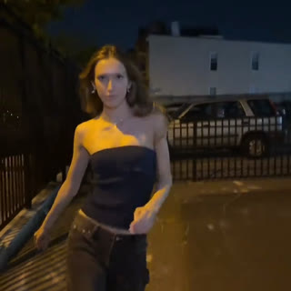](docs/screenshots/full-model-original.jpg) | [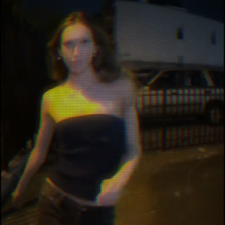](docs/screenshots/full-model-vintage.jpg) | [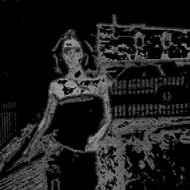](docs/screenshots/full-model-spacengrave.jpg) |

Model: [myah](https://www.instagram.com/myahcoyle/)

*Same `model.mp4` frame - original, then the two flagship looks.*

## ▶ Watch the demos

| Demo | What it does | Input video | Output video |
|---|---|---|---|
| **vintage stack** | keeps the full picture and drives it through the 9-effect CRT/VHS stack - phosphor glow, RGB edge fringing, dot-crawl color phasing, barrel distortion, vignette and slow tape drift - so it reads as a broadcast recording rather than a transform | [inputvideos/model.mp4](inputvideos/model.mp4) | [outputvideos/model-vintage-dotpipe.mp4](outputvideos/model-vintage-dotpipe.mp4) |
| **dot.spacengrave** | erases the photo to pure black and re-emits only the subject as a screen of engraved white lines that break into dashes over texture - the “president on a dollar bill” read | [inputvideos/model.mp4](inputvideos/model.mp4) | [outputvideos/model-gamma-spacengrave-dotpipe.mp4](outputvideos/model-gamma-spacengrave-dotpipe.mp4) |

## Quick start

Pick a path - both end at the same command in step 4.

**A. Shipped binary (no compiler)**

1. Download the latest `dotpipe-*-macos-universal.tar.gz` from this repo's
   Releases page and extract it - you get one file: `dotpipe`.
2. If macOS blocks it on first run: `xattr -d com.apple.quarantine dotpipe`
3. Install ffmpeg (any build works - the effects never touch ffmpeg):
   `brew install ffmpeg-full`
4. Run:

   ```sh
   ffmpeg -i in.mov -f rawvideo -pix_fmt rgb24 - |
     ./dotpipe -w 720 -h 1280 --spacengrave 5 85 80 68 200 78 360 100 5 |
     ffmpeg -f rawvideo -pix_fmt rgb24 -s 720x1280 -i - out.mp4
   ```

**B. Build from source**

1. Clone this repo and `cd dot.fx`
2. Install the tools: `xcode-select --install` (if you don't have the Xcode
   command-line tools) and `brew install ffmpeg-full`
3. `make` - builds `dotpipe/dotpipe` (~2 seconds)
4. Run the step-4 command above, with `./dotpipe/dotpipe` instead of `./dotpipe`

Stack effects by listing more flags, applied left to right:

```sh
./dotpipe -w 720 -h 1280 --scanlines 0.65 3 0 --dotgate 28 8 10
```

No flags = byte-identical passthrough; `RETROFX_BACKEND=dual` cross-checks
Metal vs CPU per frame and exits loud on mismatch.

(maintainers: `sh tools/release-build.sh [version]` builds the release binary)

### Render scripts

Scripts for the example outputs in `outputvideos/` (each runnable from
anywhere; `[-i input] [-o output]` overrides the defaults):

**These thumbnails are small - they don't show the full depth of the effects. Click any of them to open the full-size image.**

| Thumbnail | Script | Output |
|---|---|---|
| [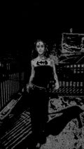](docs/screenshots/full-model-spacengrave.jpg) | `run-scripts-dotpipe/model-gamma-spacengrave-metal.sh` | `outputvideos/model-gamma-spacengrave-dotpipe.mp4` |
| [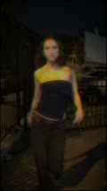](docs/screenshots/full-model-vintage.jpg) | `run-scripts-dotpipe/model-vintage-cpu.sh` | `outputvideos/model-vintage-dotpipe.mp4` |

### Effect parameters

Full parameter details (positional order, meanings, ranges): [**`PARAMETERS.md`**](PARAMETERS.md).

**These thumbnails are small - they don't show the full depth of the effects. Click any of them to open the full-size image.**

| Thumbnail | Effect | Flag | Description |
|---|---|---|---|
| [](docs/screenshots/full-shadowmask.jpg) | `vid.shadowmask` | `--mask` | makes the picture out of fine vertical stripes, slots, or dot triads - like a real TV screen |
| [](docs/screenshots/full-scanlines.jpg) | `vid.scanlines` | `--scanlines` | darkens every other line - the classic scanline look |
| [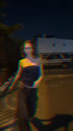](docs/screenshots/full-chromablood.jpg) | `vid.chromablood` | `--bleed` | red/blue color bleed on vertical edges, like VHS chroma smear |
| [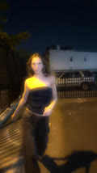](docs/screenshots/full-bloom.jpg) | `vid.bloom` | `--bloom` | soft glow around the bright parts of the frame |
| [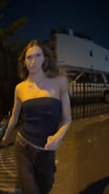](docs/screenshots/full-barrel.jpg) | `vid.barrel` | `--barrel` | bends the picture outward like convex glass; corners recede |
| [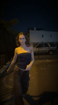](docs/screenshots/full-vignette.jpg) | `vid.vignette` | `--vignette` | darkens the four corners, center stays clean |
| [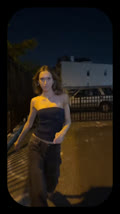](docs/screenshots/full-overscan.jpg) | `vid.overscan` | `--overscan` | clips the border and corners, like a TV bezel |
| [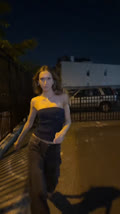](docs/screenshots/full-lumar.jpg) | `vid.lumar` | `--lumar` | a ringing halo around hard edges |
| [](docs/screenshots/full-rainbow.jpg) | `vid.rainbow` | `--rainbow` | a crawling color fringe walks the edges, like slightly out-of-sync VHS |
| [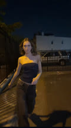](docs/screenshots/full-tapewow.jpg) | `vid.tapewow` | `--wow` | the whole picture drifts slowly up and down, like flaky tape |
| [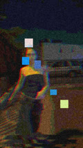](docs/screenshots/full-glitch.jpg) | `vid.glitch` | `--glitch` | glitches in bursts: slice tears, block tiles, RGB split, static, v-sync tear - each piece switchable, works after any effect (GPU) |
| [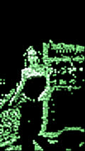](docs/screenshots/full-dotgate.jpg) | `dot.gate` | `--dotgate` | the subject becomes a field of dots on black that wobble slowly (GPU) |
| [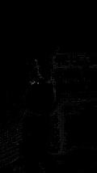](docs/screenshots/full-dotportal.jpg) | `dot.portal` | `--dotportal` | the subject becomes separated, floating dots on black - sized by tone, bent by the form (GPU) |
| [](docs/screenshots/full-spacengrave.jpg) | `dot.spacengrave` | `--spacengrave` | the photo drops to black; the subject is re-emitted as an engraved line screen - like the president on a dollar bill (GPU) |
| [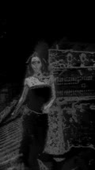](docs/screenshots/full-vapor.jpg) | vapor mode (stream-level, goes last) | `--vapor` | slow-motion trail / haze |

> ### 📖 Effect parameter details
> Positional order and meanings for every flag: [**`PARAMETERS.md`**](PARAMETERS.md)

## Compute backend (`dot.gate` / `dot.portal` / `dot.spacengrave` / `vid.glitch`)

Select with the `RETROFX_BACKEND` environment variable (the other `vid.*`
effects are CPU-only for now):

| Value | Behavior |
|---|---|
| `cpu` (default) | CPU reference implementation |
| `metal` | Metal GPU (Apple silicon) |
| `dual` | runs both, byte-compares every frame; a MISMATCH means a parity regression (either output is still usable) |

```sh
RETROFX_BACKEND=metal sh run-scripts-dotpipe/model-gamma-spacengrave-metal.sh
```

Measured CPU-vs-Metal performance on the `inputvideos/` videos:
**`PERFORMANCE.md`**.
